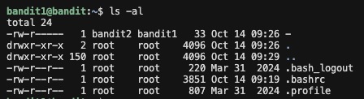
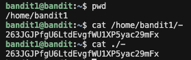
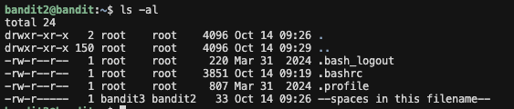
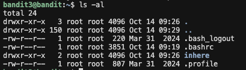
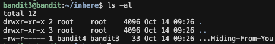
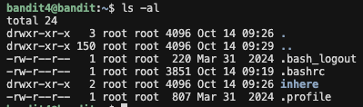
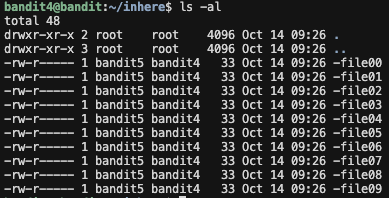
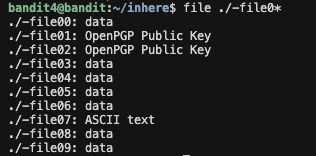
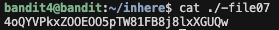

  

# 리눅스 기초 실습
#### 2026.01.19 작성
 

## bandit 0

1. 주어진 문제에 나와있는대로 `ssh bandit0@bandit.labs.overthewire.org -p 2220`을 이용해 bandit에 접속해준다.

2. password ***bandit0***를 입력한다.
3. `ls -al`로 bandit0에 있는 디렉토리 및 파일을 체킹한다.  
  

4. readme파일을 보면 사용자는 bandit1, 그룹은 bandit0임을 알 수 있다. 
readme파일은 **사용자는 읽기/쓰기 권한**, **그룹은 읽기 권한**이 있고 **그외(Others)는 아무 권한이 없다.**   
현재 나는 ***bandit0*** 계정으로 로그인하였으니 읽기 권한만 가지고 있다고 볼 수 있다.  
따라서 `cat readme`를 이용해 readme를 읽어준다.  
  

비밀번호 <u>***ZjLjTmM6FvvyRnrb2rfNWOZOTa6ip5If***</u> 를 찾았다!!  

---------

  

## bandit 1

1. `ssh bandit1@bandit.labs.overthewire.org -p 2220`을 이용해 bandit에 접속해준다.

2. password ***ZjLjTmM6FvvyRnrb2rfNWOZOTa6ip5If***를 입력한다. (이후 작성할 bandit2부터 이 과정은 생략하겠다.)
3. `ls -al`로 bandit1에 있는 디렉토리 및 파일을 체킹한다.  
  

4. - 파일을 보면 사용자는 bandit2, 그룹은 bandit1임을 알 수 있다. 
- 파일은 **사용자는 읽기/쓰기 권한**, **그룹은 읽기 권한**이 있고 **그외(Others)는 아무 권한이 없다.**   
현재 나는 ***bandit1*** 계정으로 로그인하였으니 읽기 권한만 가지고 있다고 볼 수 있다.  

이때 파일명이 - 이므로 파일명이 아닌 상대경로와 절대경로를 이용하여 파일을 읽어야한다.

    - 절대경로
    1. `pwd`를 이용하여 현재 위치를 파악한다.
    2. 현재 위치는 **/home/bandit1**이므로 `cat /home/bandit1/-`  을 이용하여 - 파일을 읽는다.

    - 상대경로 
    1. `cat ./-`을 이용하여 - 파일을 읽는다.  

비밀번호 <u>***263JGJPfgU6LtdEvgfWU1XP5yac29mFx***</u> 를 찾았다!!  

---------

  

## bandit 2

1. `ls -al`로 bandit2에 있는 디렉토리 및 파일을 체킹한다.  
  

2. --space in this filename-- 파일을 보면 사용자는 bandit3, 그룹은 bandit2임을 알 수 있다. 
--space in this filename-- 파일은 **사용자는 읽기/쓰기 권한**, **그룹은 읽기 권한**이 있고 **그외(Others)는 아무 권한이 없다.**   
현재 나는 ***bandit2***로 로그인하였으니 읽기 권한만 가지고 있다고 볼 수 있다.  

이때 파일명이 --space in this filename-- 이므로 파일명이 아닌 상대경로와 절대경로를 이용하여 파일을 읽어야한다.

    - 절대경로
    1. `pwd`를 이용하여 현재 위치를 파악한다.
    2. 현재 위치는 **/home/bandit2**이므로 `cat /home/bandit2/--spaces in this filename--`  을 이용하여 --spaces in this filename-- 파일을 읽는다.

    - 상대경로 
    1. `cat ./--spaces in this filename--`을 이용하여 --spaces in this filename-- 파일을 읽는다.

비밀번호 <u>***MNk8KNH3Usiio41PRUEoDFPqfxLPlSmx***</u> 를 찾았다!!  

---------

  

## bandit 3

1. `ls -al`로 bandit3에 있는 디렉토리 및 파일을 체킹한다.  
  

2. 디렉토리 inhere가 보인다. `cd inhere`을 이용해 inhere로 이동한다.

3. `ls -al`을 이용해 inhere에 있는 디렉토리 및 파일을 체킹한다.  
  

4. ...Hiding-From-You 파일을 보면 사용자는 bandit4, 그룹은 bandit3임을 알 수 있다. 
...Hiding-From-You 파일은 **사용자는 읽기/쓰기 권한**, **그룹은 읽기 권한**이 있고 **그외(Others)는 아무 권한이 없다.**   
현재 나는 ***bandit3***으로 로그인하였으니 읽기 권한만 가지고 있다고 볼 수 있다.  

이때 파일명이 ...Hiding-From-You 이므로 파일명이 아닌 상대경로와 절대경로를 이용하여 파일을 읽어야한다.

    - 절대경로
    1. `pwd`를 이용하여 현재 위치를 파악한다.
    2. 현재 위치는 **/home/bandit3/inhere**이므로 `cat /home/bandit3/inhere/...Hiding-From-You`  을 이용하여 ...Hiding-From-You 파일을 읽는다.

    - 상대경로 
    1. `cat ./...Hiding-From-You`을 이용하여 ...Hiding-From-You 파일을 읽는다.

비밀번호 <u>***2WmrDFRmJIq3IPxneAaMGhap0pFhF3NJ***</u> 를 찾았다!!  

---------

  

## bandit 4

1. `ls -al`로 bandit4에 있는 디렉토리 및 파일을 체킹한다.  
  

2. 디렉토리 inhere가 보인다. `cd inhere`을 이용해 inhere로 이동한다.

3. `ls -al`을 이용해 inhere에 있는 디렉토리 및 파일을 체킹한다.  
  

4. -file0* 파일들을 보면 사용자는 bandit5, 그룹은 bandit4임을 알 수 있다. 
-file0* 파일들은 **사용자는 읽기/쓰기 권한**, **그룹은 읽기 권한**이 있고 **그외(Others)는 아무 권한이 없다.**   
현재 나는 ***bandit4***로 로그인하였으니 읽기 권한만 가지고 있다고 볼 수 있다.  

5. 수많은 파일중 정답이 들어있는 파일을 찾기위해 `./file -file0*`을 사용하여 파일의 유형을 분류한다. <cd>
  

6. -file07의 유형이 아스키코드이므로 `cat ./-file07`을 이용해 -file07을 읽어준다.  
  

비밀번호 <u>***4oQYVPkxZOOEOO5pTW81FB8j8lxXGUQw***</u> 를 찾았다!!  

---------

