  

# 리눅스 기초 실습(2)
#### 2026.01.24 작성
 

## bandit 5
### 조건
-human readable file  
-1033 byte 
-not executable    

1. `ls -al`로 bandit5에 있는 디렉토리 및 파일을 체킹한다.  
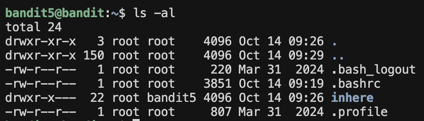  

2. `cd inhere`을 이용해 inhere 디렉토리로 이동한다.  

3. `ls -al`로 inhere에 있는 디렉토리 및 파일을 체킹한다.  
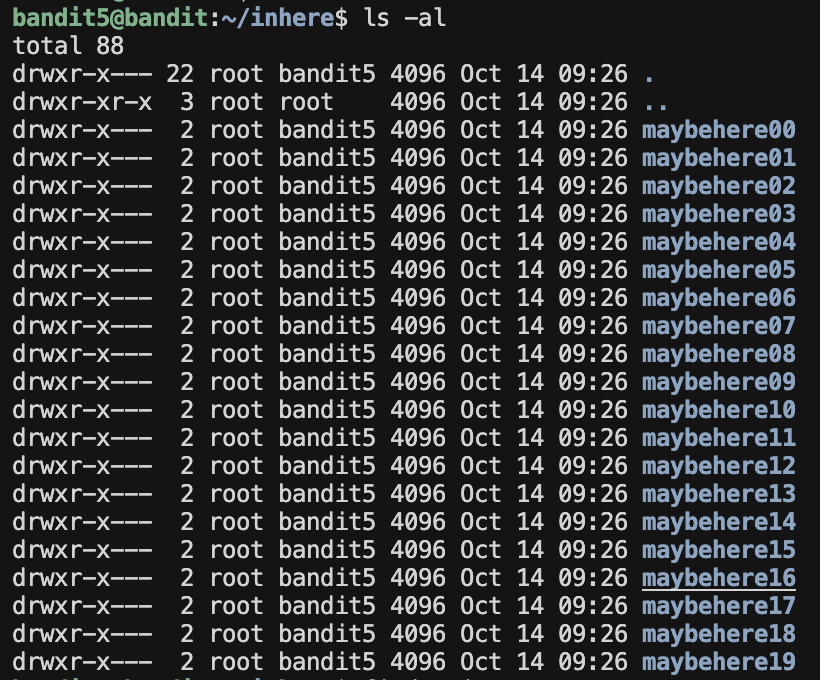   

### 방법 1
4. 문제 조건에서 정답 파일이 1033byte이라고 제시되어 있으므로 `find -size 1033c`를 이용하여 파일을 찾아준다.  
  

(확인을 위해 `cd maybehere07`로 이동한 뒤 `ls -al`을 이용하여 .file2을 체크한다. 
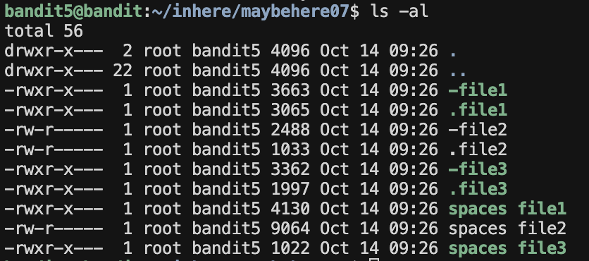  

 .file2 파일을 보면 사용자는 root, 그룹은 bandit5임을 알 수 있다. 
.file2 파일은 **사용자는 읽기/쓰기 권한**, **그룹은 읽기 권한**이 있고 **그외(Others)는 아무 권한이 없다.**   
현재 나는 ***bandit5***로 로그인하였으니 읽기 권한만 가지고 있다고 볼 수 있다.  
즉 실행할 수 있는 권한이 없으므로 not executable 조건도 만족시킨다.)

### 방법 2

4. 1033바이트이면서 읽을 수는 있지만 실행시킬 수 없는 파일을 한 번에 찾아보자.  
`find ./ -type f -readble ! -executable -size 1033c`을 이용해 한 번에 파일을 찾을 수 있다.  
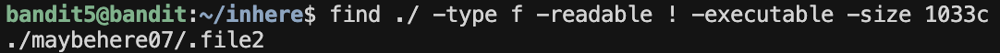  

5. 파일 경로를 찾았으니 `cat ./maybehere07/.file2`를 이용해 파일을 읽어준다.(확인 과정 생략했을 때 현재 inhere디렉토리 안에 있을 때 경로이고 확인 과정을 거쳤을 경우 현재 maybehere07에 있으므로 `cat ./.file2`로 읽어주면 된다.)

비밀번호 <u>***HWasnPhtq9AVKe0dmk45nxy20cvUa6EG***</u> 를 찾았다!!  

---------

  

## bandit 6
### 조건
-owned by user bandit7  
-owned by group bandit6  
-33bytes in size    

1. `ls -al`로 bandit6에 있는 디렉토리 및 파일을 체킹한다.  
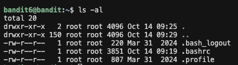  

2. 정답이 있는 디렉토리 및 파일을 파악하기가 쉽지 않으므로 `find / -type f -user bandit7 -group bandit6 -size 33c`를 이용해 조건에 맞는 파일을 바로 찾는다.  
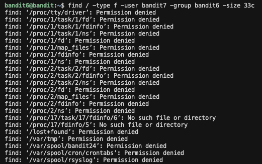

3. 오류가 뜨는 파일들이 가득하다. 오류가 뜨는 파일들을 모두 제거하기 위해 `2>/dev/null`을 사용할 것이다.    
`find / -type f -user bandit7 -group bandit6 -size 33c 2>/dev/null`을 이용하여 정답 파일을 찾아준다.  
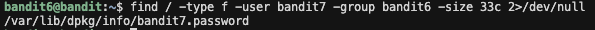

5. 파일 경로를 찾았으니 `cat /var/lib/dpkg/info/bandit7.password`를 이용해 파일을 읽어준다.

비밀번호 <u>***morbNTDkSW6jIlUc0ymOdMaLnOlFVAaj***</u> 를 찾았다!!  

---------

  

## bandit 7
### 조건
-data.txt 파일 안 단어 millionth 옆에 있음  

### 방법 1
1. 찾아야하는 것은 data.txt 파일 안 millionth라는 단어이다. `grep millionth data.txt`를 이용하여 data.txt 파일 안 millionth 단어를 찾아준다.  
  

### 방법 2
1. data.txt 파일을 읽은 뒤 그 내용 속에서 millionth를 찾아보자. 먼저 `cat data.txt`를 이용하여 data.txt 파일을 읽어준다.
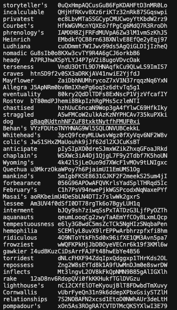

2. 파일 내용이 어마무시하게 쏟아져 나온다. 파이프라인을 이용해 내용 출력과 millionth 검색을 연결해줄 것이다. `cat data.txt | grep millionth`를 이용하여 data.txt 내용 속에서 millionth라는 단어를 찾아내보자.  
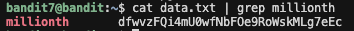

비밀번호 <u>***dfwvzFQi4mU0wfNbFOe9RoWskMLg7eEc***</u> 를 찾았다!!  

---------

  

## bandit 8
### 조건
-data.txt 파일에 있음  
-비밀번호는 딱 한번만 발생하는 문자열임  

1. 먼저 `cat data.txt`을 이용해 data.txt 파일을 읽어보자.  
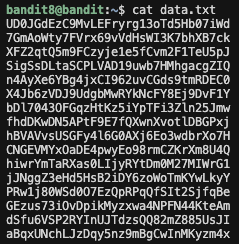  

2. 비밀번호는 딱 한번만 발생하는 문자열이므로 중복되는 문자열들은 모두 지워야한다. uniq 명령어를 사용해 중복되는 문자열을 제거할 것인데, uniq 명령어는 이어진 내용의 중복을 제거하는 명령어 이므로 sort 명령어와 함께 사용할 것이다.  
`sort data.txt | uniq -c`를 이용하여 중복되는 문자열들을 지우고 몇 번 중복되었는지 출력하도록 한다. 
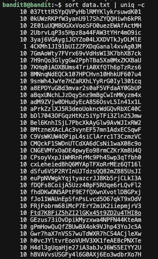

3. 직접 결과를 보면서 1을 찾아도 되고 2번의 명령어에 grep을 붙여서 1을 바로 찾아 낼 수도 있다. 이때 그냥 grep 1을 하면 모든 문자열이 출력이 되니 꼭 "1 "의 형식으로 띄어쓰기를 붙여서 찾아내야한다.  
`sort data.txt | uniq -c | grep "1 "`  
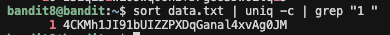

비밀번호 <u>***4CKMh1JI91bUIZZPXDqGanal4xvAg0JM***</u> 를 찾았다!!  

---------

  

## bandit 9
### 조건
-data.txt 파일에 있음  
-사람이 읽을 수 있는 문자열 중 하나임  
-몇 개의 '=' 기호 뒤에 있음  

1. `cat data.txt`를 이용해 data.txt 파일을 읽어준다.  
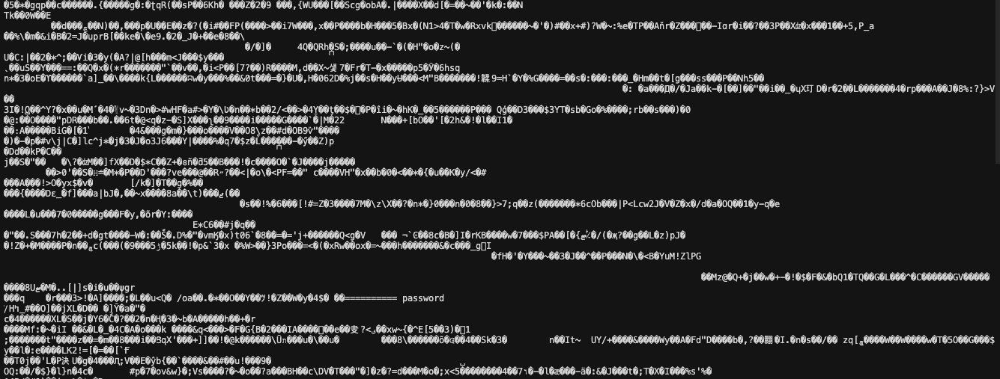  

2. 이중에서 기호 "="를 찾기 위해 grep을 이용할 것이다.  
`cat data.txt | grep "="`을 이용하여 "="를 찾아보자.

3. data.txt 파일이 바이너리 파일이라 grep 명령어를 사용할 수 없다. 이에 strings 명령어를 이용하여 사람이 읽을 수 있는 문자열을 뽑아낼 것이다.  
`cat data.txt | strings`  
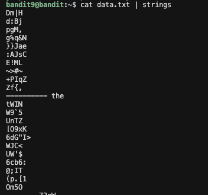

5. 이제 이 결과를 grep을 이용해 넘겨주면 비밀번호를 찾을 수 있다.  
`cat data.txt | strings | grep "="`  
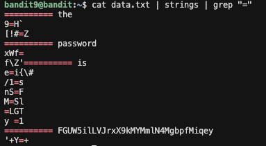

비밀번호 <u>***FGUW5ilLVJrxX9kMYMmlN4MgbpfMiqey***</u> 를 찾았다!!  

---------

  

## bandit 10
### 조건
-data.txt 파일에 있음  
-base64로 인코딩 되어있음

1. `cat data.txt`로 data.txt 파일을 읽어준다  
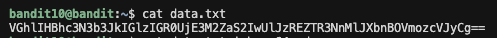  

2. 비밀번호는 base64로 인코딩 되어 있으므로 `cat data.txt | base64 -d`를 이용해 비밀번호를 디코딩 해준다.  

비밀번호 <u>***dtR173fZKb0RRsDFSGsg2RWnpNVj3qRr***</u> 를 찾았다!!  

