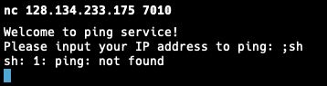
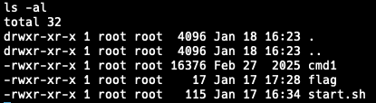
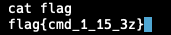
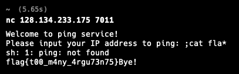
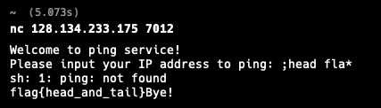
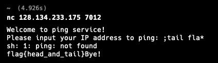

  

# Command injection 실습
#### 2026.01.27 작성
 

## Command injection 1

1. `;sh`로 서브쉘을 열어준다.  
  

2. `ls -al`로 디렉토리 및 파일을 체킹한다.  

3. `cat flag`를 이용하여 flag 파일을 읽어준다.  

비밀번호 <u>***flag{cmd_1_15_3z}%***</u> 를 찾았다!!  

---------

 

## Command injection 2
### ban
-flag  
-sh  

1. sh, flag 사용 시 **Nah.. I don't like that!** 을 출력하므로 *를 이용해 우회하여 접근할 것이다.  
`;cat fla*`를 이용하여 바로 flag 파일을 읽어내자.  
  

비밀번호 <u>***flag{t00_m4ny_4rgu73n75}%***</u> 를 찾았다!!  

---------

 

## Command injection 3
### ban
-flag  
-sh  
-vi  
-cat  
-ls  
-pwd  

1. 이번에는 명령어 head와 tail, *를 이용해 우회하여 접근할 것이다.  
`;head fla*`를 이용하여 flag 파일의 앞부분을 읽어낸다.  
  

2. `;tail fla*`를 이용하여 flag 파일의 뒷부분을 읽어낸다.  
  

비밀번호 <u>***flag{head_and_tail}***</u> 를 찾았다!!  

---------

 

## Command injection 4
### ban
-flag  
-sh  
-vi  
-cat  
-ls  
-pwd  
-head  
-tail  
-*  
-;  
-/  
-|  

1. 이번에는 명령어 head와 tail, *를 이용해 우회하여 접근할 것이다.  
`;head fla*`를 이용하여 flag 파일의 앞부분을 읽어낸다.  
  

2. `;tail fla*`를 이용하여 flag 파일의 뒷부분을 읽어낸다.  
  

비밀번호 <u>***flag{head_and_tail}***</u> 를 찾았다!!  

---------